# Linux Network
### Contents
1. [Part 1. ipcalc tool](#part-1-ipcalc-tool)
2. [Part 2. Static routing between two machines](#part-2-static-routing-between-two-machines)
3. [Part 3. iperf3 utility](#part-3-iperf3-utility)
4. [Part 4. Network firewall](#part-4-network-firewall)
5. [Part 5. Static network routing](#part-5-static-network-routing)
6. [Part 6. Dynamic IP configuration using DHCP](#part-6-dynamic-ip-configuration-using-dhcp)
7. [Part 7. NAT](#part-7-nat)
8. [Part 8. Bonus. Introduction to SSH Tunnels](#part-8-bonus-introduction-to-ssh-tunnels)

## Part 1. ipcalc tool  
- `ipcalc <IP> <NETMASK>`  
- `ipcalc <IP>/<PREFIX>`    
  
1.1. Networks and Masks  
1. network address of 192.167.38.54/13 :  
   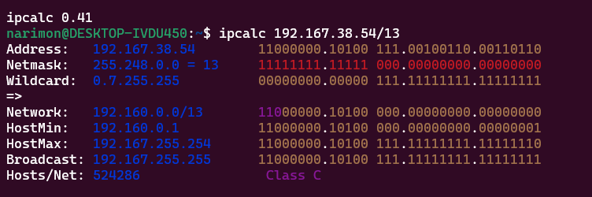   
   **Answer:** `192.160.0.0/13`  
2. Conversion of the mask 255.255.255.0 to prefix and binary, /15 to normal and binary, 11111111.11111111.11111111.11110000 to normal and prefix

   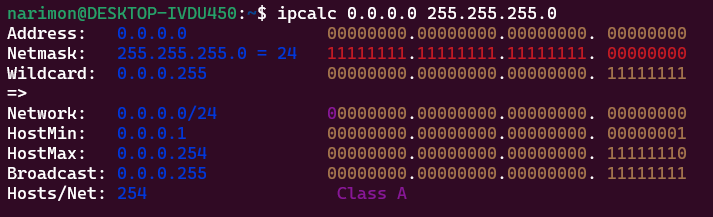  
   **Prefix:** `/24`  
   **Binary:** `11111111.11111111.11111111.00000000`
   
   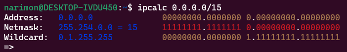  
   **Normal:** `255.254.0.0`  
   **Binary:** `11111111.11111110.00000000.00000000`

   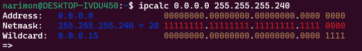  
   **Normal:** 255.255.255.240  
   **Prefix:** `/28`

3. minimum and maximum host in 12.167.38.4 network with masks: /8, 11111111.11111111.00000000.00000000, 255.255.254.0 and /4

   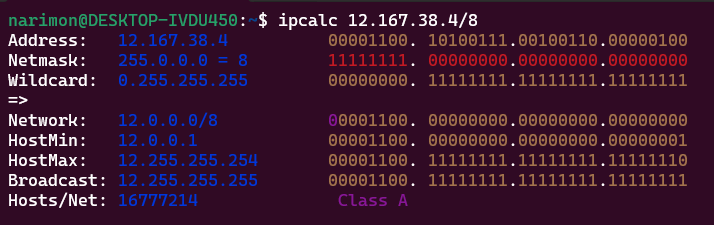  
   **minimum host:** 12.0.0.1  
   **maximum host:** 12.255.255.254

   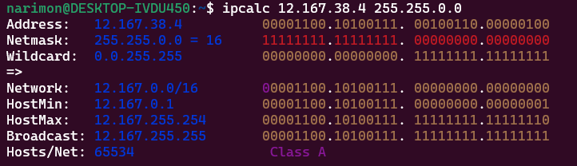  
   **minimum host:** 12.167.0.1  
   **maximum host:** 12.167.255.254

   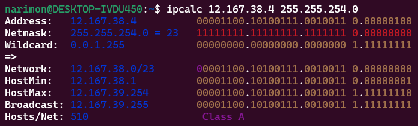  
   **minimum host:** 12.167.38.1  
   **maximum host:** 12.167.39.254

   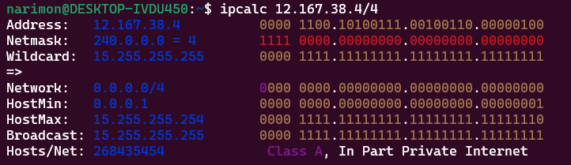  
   **minimum host:** 0.0.0.1  
   **maximum host:** 15.255.255.254  
     
1.2. localhost
- Define and write in the report whether an application running on localhost can be accessed with the following IPs: 194.34.23.100, 127.0.0.2, 127.1.0.1, 128.0.0.1
- **Hint:** *127.0.0.0* — *127.255.255.255* (Reserved for loopback interfaces (not used for communication between network nodes), so called localhost).

   194.34.23.100 => No  
   127.0.0.2 => Yes  
   127.1.0.1 => Yes  
   128.0.0.1 => No

     
1.3. Network ranges and segments

1. which of the listed IPs can be used as public and which only as private: 10.0.0.45, 134.43.0.2, 192.168.4.2, 172.20.250.4, 172.0.2.1, 192.172.0.1, 172.68.0.2, 172.16.255.255, 10.10.10.10, 192.169.168.1

  - **Hint=>** Private Ips:  
  *10.0.0.0* — *10.255.255.255* (*10.0.0.0/8*);  
  *172.16.0.0* — *172.31.255.255* (*172.16.0.0/12*);  
  *192.168.0.0* — *192.168.255.255* (*192.168.0.0/16*);
  - **Answer:**  
  10.0.0.45 => Private  
  134.43.0.2 => Public  
  192.168.4.2 => Private  
  172.20.250.4 => Private  
  172.0.2.1 => Public  
  192.172.0.1 => Public  
  172.68.0.2 => Public  
  172.16.255.255 => Private  
  10.10.10.10 => Private  
  192.169.168.1 => Public  

2. which of the listed gateway IP addresses are possible for 10.10.0.0/18 network: 10.0.0.1, 10.10.0.2, 10.10.10.10, 10.10.100.1, 10.10.1.255

   10.0.0.1 => Yes  
   10.10.0.2 => No  
   10.10.10.10 => No  
   10.10.100.1 => No (another network)  
   10.10.1.255 => No
   
   
## Part 2. Static routing between two machines

- View existing network interfaces with the `ip a` command  
   - ws1 :  
      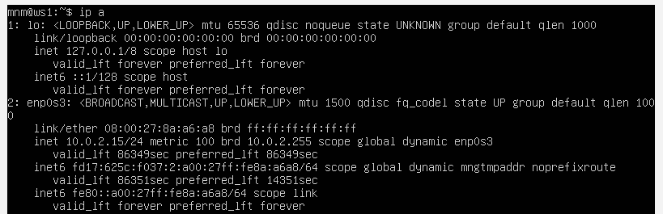
   - ws2 :  
      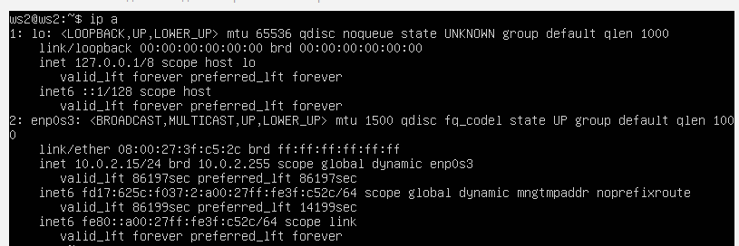

- Describe the network interface corresponding to the internal network on both machines and set the following addresses and masks: ws1 — 192.168.100.10, mask */16 *, ws2 — 172.24.116.8, mask /12
   - for both ws1 and ws2 :
      
      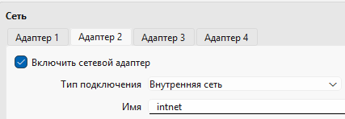  
      then => `sudo ip link set enp0s8 up`

   - ws1 :

      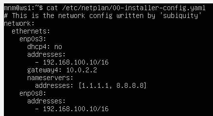

      Run the `sudo netplan apply` command to restart the network service  
      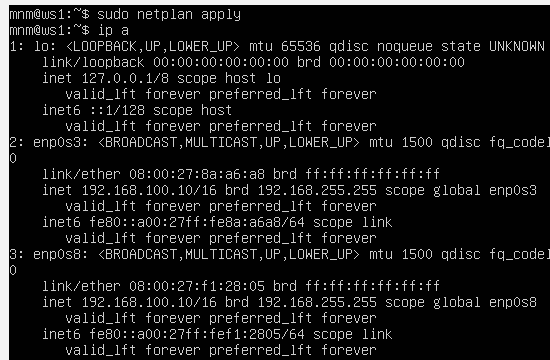
   - ws2 :

      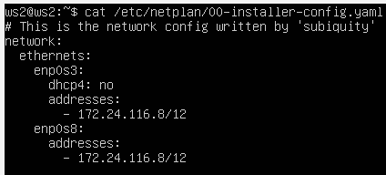
      
      Run the `sudo netplan apply` command to restart the network service  
      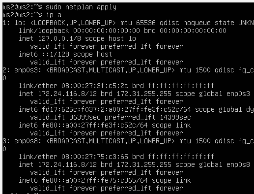

#### 2.1. Adding a static route manually
- Add a static route from one machine to another and back using a `ip r add` command.
   - **first** :  
      ws1 => `sudo ip r add 172.24.116.8 dev enp0s8`  
      ws2 => `sudo ip r add 192.168.100.10 dev enp0s8`  
- Ping the connection between the machines

   ws1 :  
      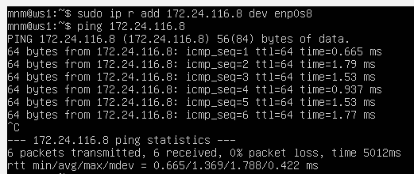

   ws2 :  
      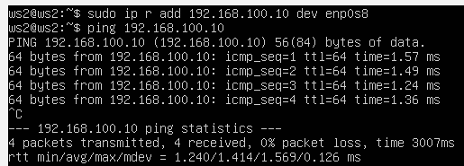

#### 2.2. Adding a static route with saving
- Restart the machines  
   `sudo reboot` for both ws1 and ws2
- Add static route from one machine to another using /etc/netplan/00-installer-config.yaml file
   - ws1 :

      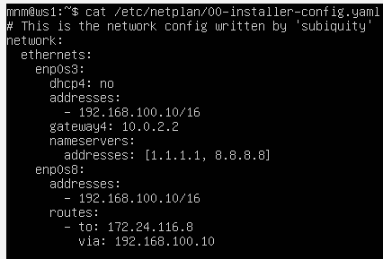
   - ws2 :

      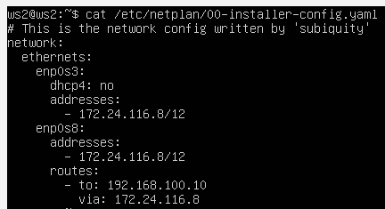

- Ping the connection between the machines

   ws1 :  
      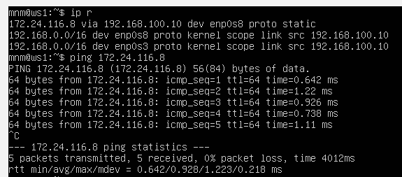

   ws2 :  
      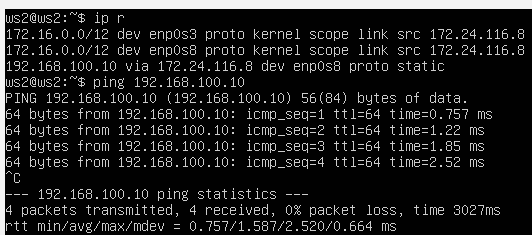

## Part 3. iperf3 utility
#### 3.1. Connection speed
- Convert and write results in the report: 8 Mbps to MB/s, 100 MB/s to Kbps, 1 Gbps to Mbps :

   8 Mbps => 1 MB/s  
   100 MB/s => 100*1024*8 Kbps  => 819200 Kbps  
   1 Gbps => 1000 Mbps
   
#### 3.2. iperf3 utility
- Measure connection speed between ws1 and ws2

   - The sever ws1:

      `sudo iperf3 -s` :  
      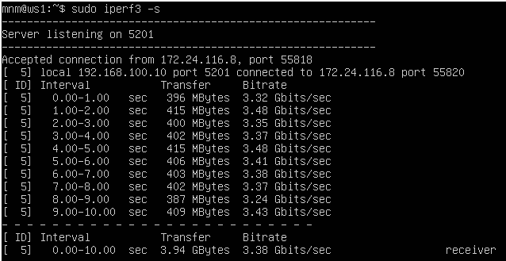

   - The client ws2:

      `sudo iperf3 -c 192.168.100.10` :  
      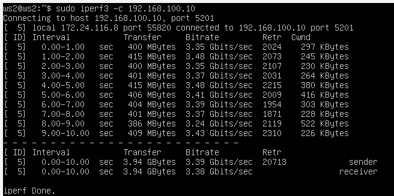
   
   - The connection speed calculated only using the results obtained from the **iperf3** client machine in every test

      Connection Speed : `3.39 Gbits/s`

## Part 4. Network firewall

#### 4.1. iptables utility

Create a /etc/firewall.sh file simulating the firewall on ws1 and ws2:
   1. on ws1 apply a strategy where a deny rule is written at the beginning and an allow rule is written at the end (this applies to points 4 and 5);
   2. on ws2 apply a strategy where an allow rule is written at the beginning and a deny rule is written at the end (this applies to points 4 and 5);
   3. open access on machines for port 22 (ssh) and port 80 (http);
   4. reject echo reply (machine must not ping, i.e. there must be a lock on OUTPUT);
   5. allow echo reply (machine must be pinged);
   - RESULT:  

      ws1 :  
         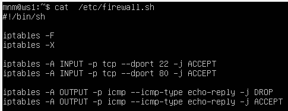
         
      ws2 :  
         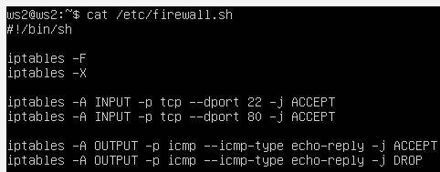

Run the files on both machines with `chmod +x /etc/firewall.sh` and `/etc/firewall.sh` commands.  
   - ws1 :

      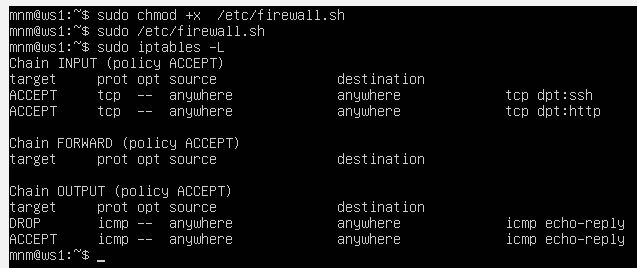  
      blocks `echo reply` => Because iptables processes rules from top to bottom, the first matching rule (DROP) is applied and the second rule (ACCEPT) is never executed.
         
   - ws2 :

      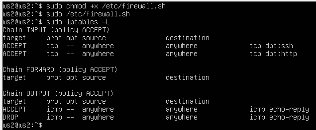  
      allows `echo reply` => Because iptables processes rules from top to bottom, the first matching rule  (ACCEPT) is applied and the second rule (DROP) is never executed.
      
#### 4.2. nmap utility
- Use ping command to find a machine which is not pinged, then use nmap utility to show that the machine host is up
   - ws1 :

      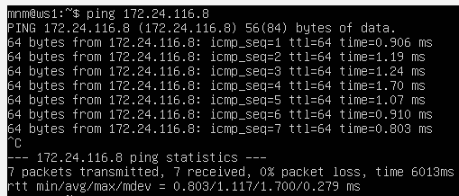

   - ws2 :

      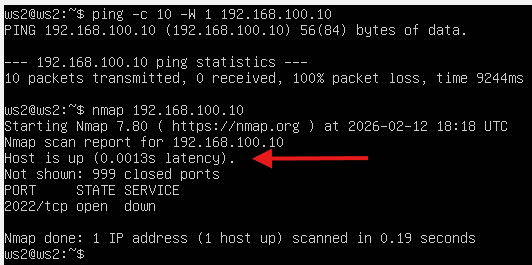

## Part 5. Static network routing
Network: \

Start five virtual machines (3 workstations (ws11, ws21, ws22) and 2 routers (r1, r2))

#### 5.1. Configuration of machine addresses
Set up the machine configurations in *etc/netplan/00-installer-config.yaml* according to the network in the picture. 
   - r1 : \
   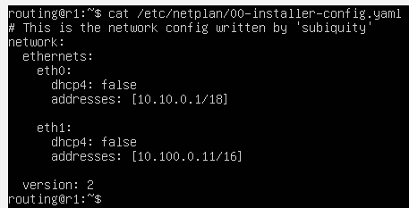
   - r2 : \
   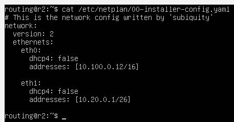
   - PC-ws11 : \
   
   - PC-ws21 : \
   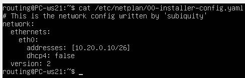
   - PC-ws22 : \
   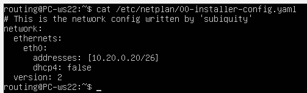

Restart the network service. If there are no errors, check that the machine address is correct with the `ip -4 a`command. Also ping ws22 from ws21. Similarly ping r1 from ws11.
   - r1 : \
   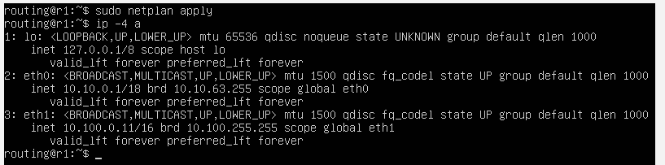
   - r2 : \
   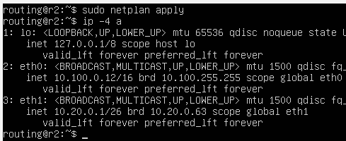
   - PC-ws11 : \
   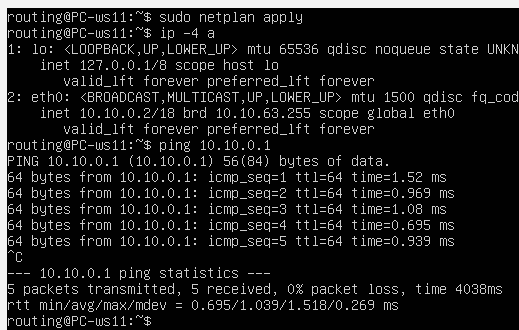
   - PC-ws21 : \
   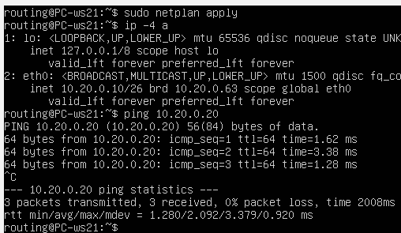
   - PC-ws22 : \
   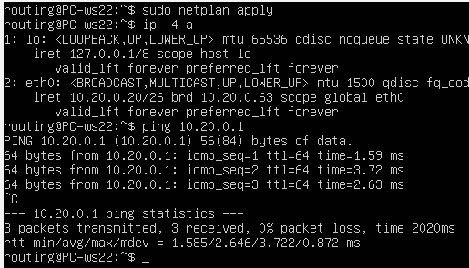

#### 5.2. Enabling IP forwarding.
To enable IP forwarding, run the following command on the routers: `sysctl -w net.ipv4.ip_forward=1`.
*With this approach, the forwarding will not work after the system is rebooted.* 
   - r1 : \
   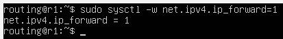
   - r2 : \
   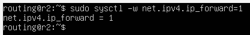

Open */etc/sysctl.conf* file and add the following line: `net.ipv4.ip_forward = 1`
*With this approach, IP forwarding is enabled permanently.*
   - r1 : \
   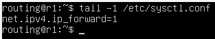
   - r2 : \
   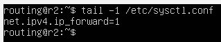
   
#### 5.3. Default route configuration
Configure the default route (gateway) for the workstations. To do this, add default before the router's IP in the configuration file
   - PC-ws11 : \
   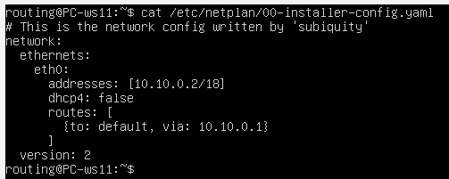
   - PC-ws21 : \
   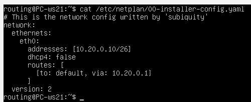
   - PC-ws22 : \
   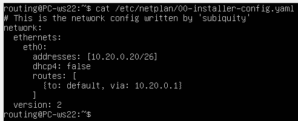

Call `ip r` and show that a route is added to the routing table
   - PC-ws11 : \
   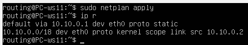
   - PC-ws21 : \
   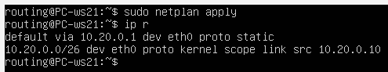
   - PC-ws22 : \
   

Ping r2 router from ws11 and show on r2 that the ping is reaching. To do this, use the `tcpdump -tn -i eth0` command.
   - PC-ws11 : \
   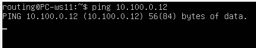
   - r2 : \
   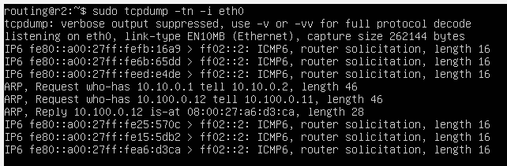

#### 5.4. Adding static routes

Add static routes to r1 and r2 in configuration file.
   - r1 : \
   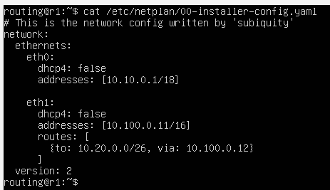
   - r2 : \
   
   
Call `ip r` and show route tables on both routers.
   - r1 : \
   
   - r2 : \
   
   
Run `ip r list 10.10.0.0/[netmask]` and `ip r list 0.0.0.0/0` commands on ws11.
   - PC-ws11 : \
      
      - The route 10.10.0.0/18 was selected because it is more specific than the default route 0.0.0.0/0. According to the Longest Prefix Match rule, the system always selects the route with the longest netmask

#### 5.5. Making a router list
Run the `tcpdump -tnv -i eth0` dump command on r1  
Use `traceroute` utility to list routers in the path from ws11 to ws21

   - Traceroute works by sending packets with gradually increasing TTL (Time To Live) values.
   - Traceroute constructs the network path using the TTL field in IP packets. Each router decreases TTL by 1. When TTL reaches zero, the router sends an ICMP Time Exceeded message. By increasing TTL step by step, traceroute discovers each router between source and destination.
   - So it discovers routers one by one

#### 5.6. Using ICMP protocol in routing
Run on r1 network traffic capture going through eth0 with the `tcpdump -n -i eth0` icmp command.  
Ping a non-existent IP (e.g. 10.30.0.111) from ws11 with the `ping -c 1 10.30.0.111` command.
- ws11 => `ping -c 1 10.30.0.111` : \
   
- r1 => `tcpdump -n -i eth0` : \
   

Save dumps of the virtual machine images

## Part 6. Dynamic IP configuration using DHCP

In this task you need to use virtual machines from Part 5.

For r2, configure the DHCP service in the /etc/dhcp/dhcpd.conf file:
1) Specify the default router address, DNS-server and internal network address.  
   
2) Write nameserver 8.8.8.8 in a resolv.conf file  
     
3) change ws21 and ws22 `dhcp4: true`: \
     
     

Restart the DHCP service with `systemctl restart isc-dhcp-server`. Reboot the ws21 machine with `reboot` and show with `ip a` that it has got an address. Also ping ws22 from ws21.  
     
     
     

Specify MAC address at ws11 by adding to etc/netplan/00-installer-config.yaml:  
macaddress: 10:10:10:10:10:BA, dhcp4: true  
     

Сonfigure r1 the same way as r2, but make the assignment of addresses strictly linked to the MAC-address (ws11). Run the same tests  
     
     
   
Request IP address update from ws21  
     
   The DHCP server provided Option 1 (subnet mask), Option 3 (default gateway), Option 6 (DNS server), and Option 51 (IP lease time) to configure the client’s network settings.

Save dumps of virtual machine images

## Part 7. NAT

In this task you need to use virtual machines from Part 5  

In /etc/apache2/ports.conf file change the line `Listen 80` to `Listen 0.0.0.0:80` on ws22 and r1, i.e. make the Apache2 server public  
     
     

Start the Apache web server with `service apache2 start` command on ws22 and r1  
     
   

Add the following rules to the firewall, created similarly to the firewall from Part 4, on r2:  
   delete rules in the filter table — iptables -F  
   delete rules in the "NAT" table — iptables -F -t nat  
   drop all routed packets — iptables --policy FORWARD DROP   
      

Run the file as in Part 4  
   

Check the connection between ws22 and r1 with the `ping` command  
When running the file with these rules, ws22 should not ping from r1  
   

Add another rule to the file:  
   allow routing of all ICMP protocol packets  
     
   Run the file as in Part 4

Check connection between ws22 and r1 with the `ping` command  
When running the file with these rules, ws22 should ping from r1  
   

Add two more rules to the file:

enable SNAT, which is masquerade all local IP from the local network behind r2 (as defined in Part 5 — network 10.20.0.0)  
Tip: it is worth thinking about routing internal packets as well as external packets with an established connection 

enable DNAT on port 8080 of r2 machine and add external network access to the Apache web server running on ws22  
*Tip: be aware that when you will try to connect, there will be a new tcp connection for ws22 and port 80

     
   Run the file as in Part 4

Before testing it is recommended to disable the NAT network interface in VirtualBox (its presence can be checked with `ip a` command), if it is enabled

Check the TCP connection for SNAT by connecting from ws22 to the Apache server on r1 with the `telnet [address] [port]` command  
   

Check the TCP connection for DNAT by connecting from r1 to the Apache server on ws22 with the telnet command (`address r2 and port 8080`)  
   

Save dumps of virtual machine images

## Part 8. Bonus. Introduction to SSH Tunnels

In this task you need to use virtual machines from Part 5.

Run a firewall on r2 with the rules from Part 7  
   

Start the Apapche web server on ws22 on localhost only (i.e. in `/etc/apache2/ports.conf` file change the line `Listen 80` to `Listen localhost:80`)  
   

Use Local TCP forwarding from ws21 to ws22 to access the web server on ws22 from ws21  
     
   

Use Remote TCP forwarding from ws11 to ws22 to access the web server on ws22 from ws11  
     
   

To check if the connection worked in both of the previous steps, go to a second terminal (e.g. with the Alt + F2) and run the `telnet 127.0.0.1 [local port]` command.

Save dumps of virtual machine images
