# 🚀 LinuxMonitoring v2.0

A complete Linux system monitoring and stress-testing toolkit built with Bash.

This project provides scripts for:
- Generating files and logs
- Simulating disk load and system stress
- Cleaning up generated data
- Parsing and analyzing logs
- Visual monitoring using GoAccess, Prometheus, and Grafana
- Exporting custom system metrics

---

## 📌 Features

### 🗂 File & System Load Simulation
- Generate folders and files with controlled naming rules
- Simulate heavy disk usage
- Randomized file distribution across the filesystem
- Automatic stop when disk space reaches critical threshold

### 🧹 Cleanup Tools
- Remove generated files:
  - By log file
  - By date range
  - By filename mask

### 📄 Log Generation
- Generate realistic **NGINX access logs**
- Includes:
  - Valid IP addresses
  - HTTP methods (GET, POST, etc.)
  - Response codes (2xx, 4xx, 5xx)
  - User agents
  - Chronological timestamps

### 📊 Log Analysis
- Parse logs using `awk`
- Extract:
  - Sorted responses
  - Unique IP addresses
  - Error requests
  - IPs causing errors

### 🌐 Visualization
- **GoAccess** for real-time log visualization (terminal + web UI)
- **Prometheus + Grafana** for system monitoring dashboards

### 📈 System Monitoring
- Track:
  - CPU usage
  - RAM usage
  - Disk space
  - Disk I/O
- Stress testing using `stress`

### ⚙️ Custom Metrics Exporter
- Custom lightweight alternative to node_exporter
- Exposes system metrics in Prometheus format
- Served via NGINX
- Auto-refresh (bash loop-based)

---

## 📁 Project Structure
```
src/
├── 01/ # File generator
├── 02/ # File system clogging
├── 03/ # Cleanup
├── 04/ # Log generator
├── 05/ # Log analyzer
├── 06/ # GoAccess setup
├── 07/ # Prometheus & Grafana
├── 08/ # Dashboard & network test
├── 09/ # Custom exporter
```


Each module:
- Has its own folder
- Uses `main.sh` as entry point
- Is split into smaller reusable scripts

---

## ⚙️ Requirements

- Ubuntu Server (recommended)
- Bash
- NGINX
- awk
- curl

Optional tools:
- GoAccess
- Prometheus
- Grafana
- stress
- iperf3

---

## 🚀 Usage

### 1. File Generator

```bash
./main.sh /path 4 az 5 az.az 3kb
```

| Param | Description                   |
| ----- | ----------------------------- |
| 1     | Absolute path                 |
| 2     | Number of folders             |
| 3     | Letters for folder names      |
| 4     | Files per folder              |
| 5     | File name + extension letters |
| 6     | File size (KB ≤ 100)          |
---
### 2. File System Clogging

```bash
./main.sh az az.az 3Mb
```
- Creates folders across filesystem
- Random number of files per folder
- Stops when disk < 1GB free
---

### 3. Cleanup
```bash
./main.sh 1   # by log
./main.sh 2   # by date
./main.sh 3   # by mask
```
---

### 4. Log Generator
```bash
./main.sh
```
#### Generates:
- 5 log files (1 per day)
- 100–1000 entries per file
---

### 5. Log Analyzer
```bash
./main.sh 1   # sort by response
./main.sh 2   # unique IPs
./main.sh 3   # error requests
./main.sh 4   # error IPs
```
---

### 6. GoAccess
```bash
./main.sh <OPTION>
```
#### Available Options
| Option | Description                    |
| ------ | ------------------------------ |
|  1     | Analyze logs in terminal mode  |
|  2     | Launch web interface dashboard |
   

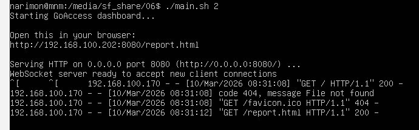
---

### 7. Prometheus & Grafana
```bash
```bash
./main.sh <OPTION>
```
  
#### Available Options
| Option    | Description                                               |
| --------- | --------------------------------------------------------- |
| `--help`  | Show help message                                         |
| `--check` | Check installation status of all components               |
| `1`       | Install Prometheus                                        |
| `2`       | Install Node Exporter                                     |
| `3`       | Install Grafana                                           |
| `--all`   | Install full stack (Prometheus + Node Exporter + Grafana) |  
&nbsp;  

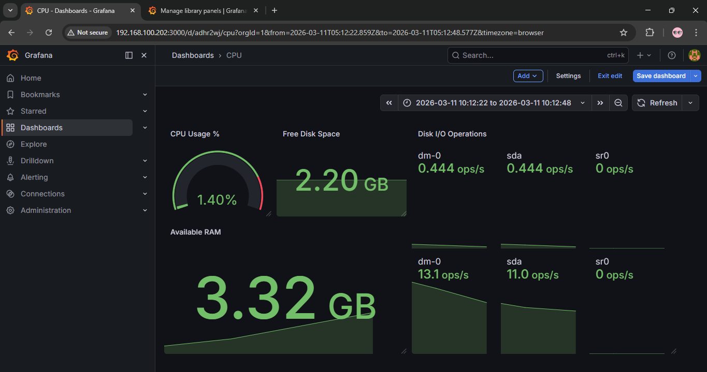

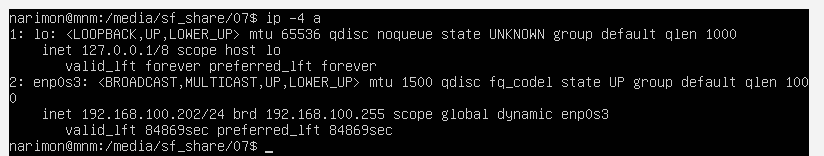

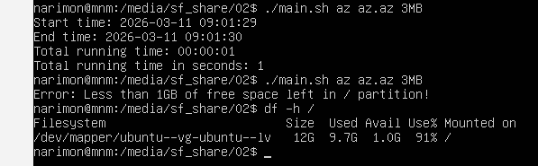

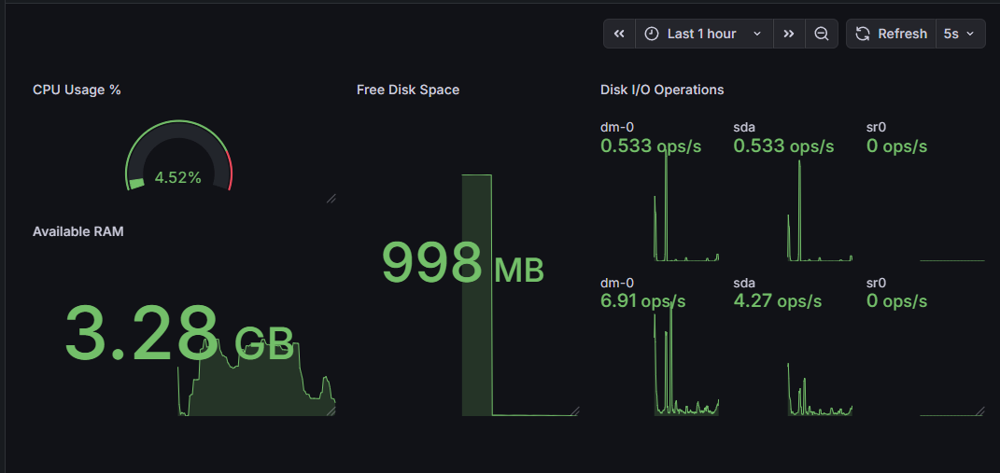

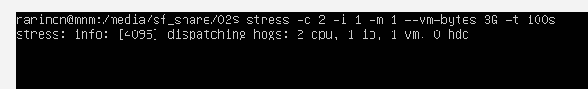

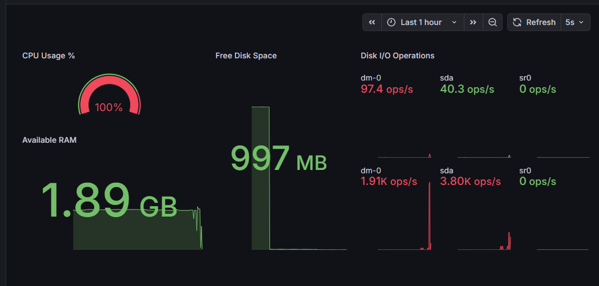


--- 

### 🌐 Task 8 — Ready-Made Dashboard & Network Testing
#### Script is same as 7 
&nbsp;  

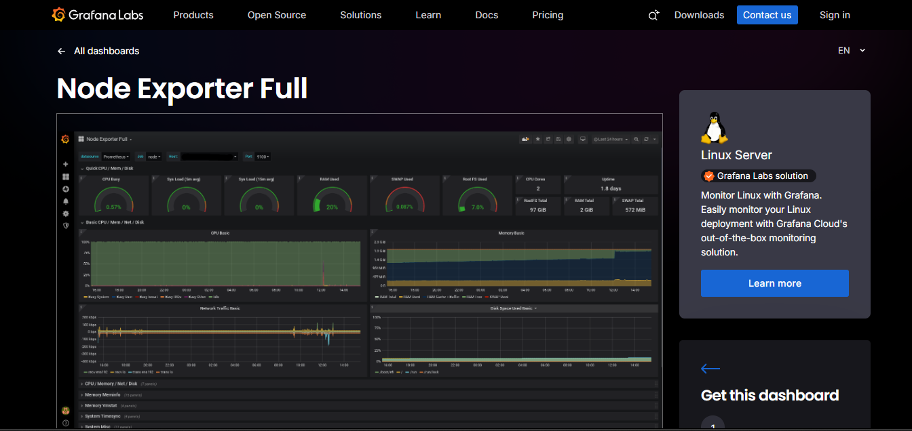

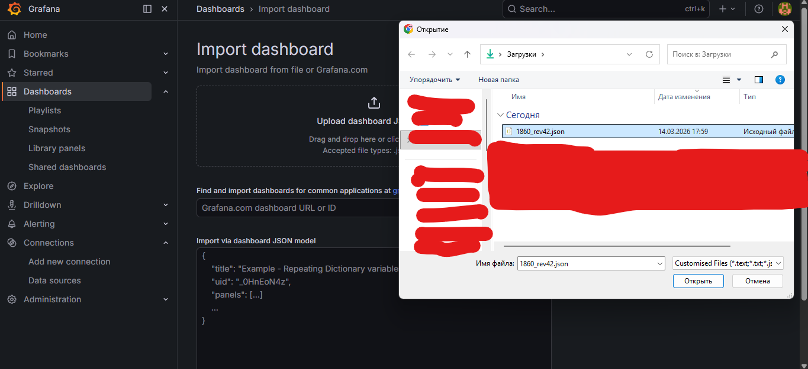

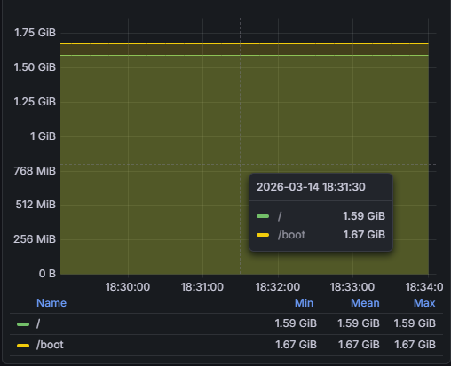

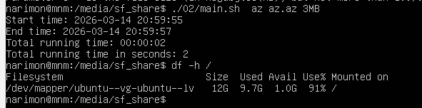

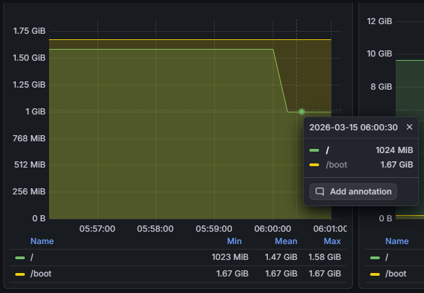

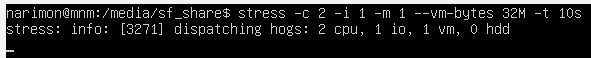

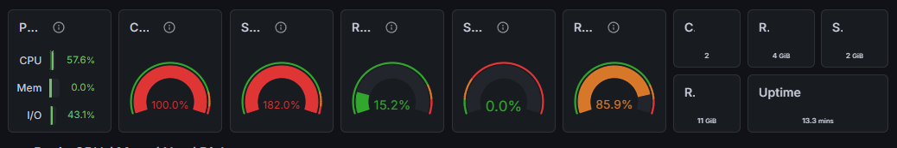

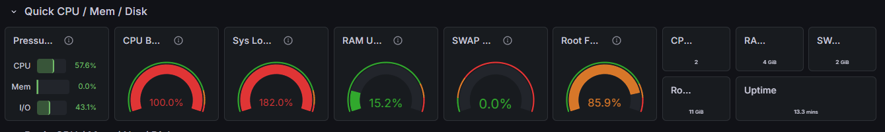

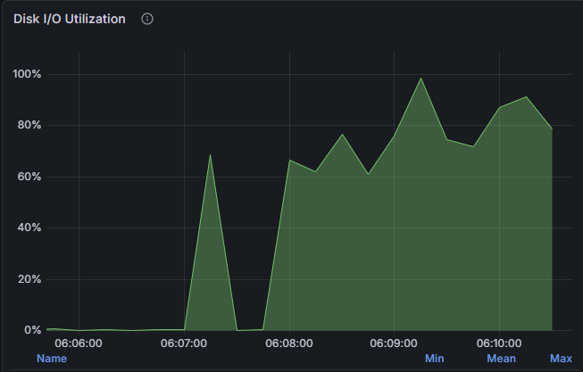

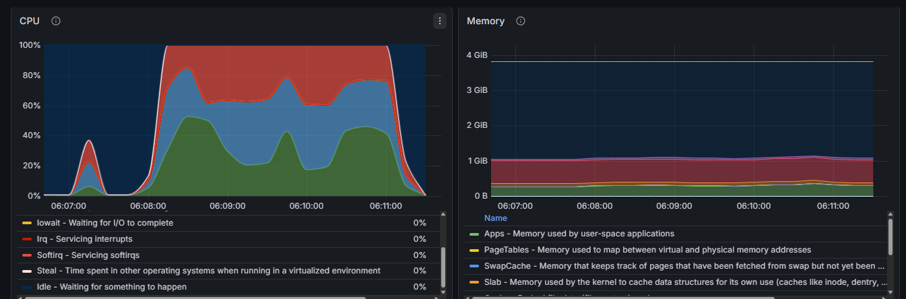

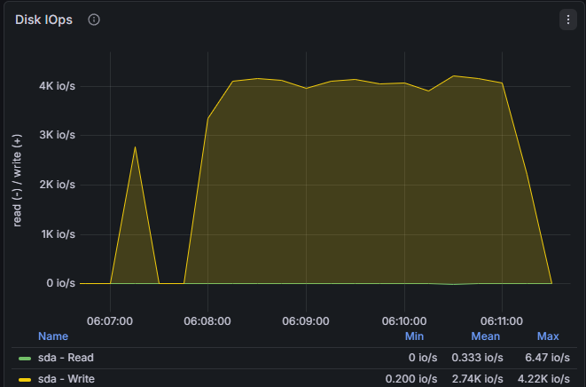

[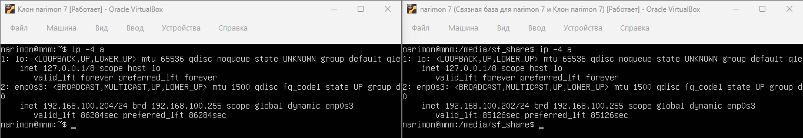](./08/prove/3.0.png)

[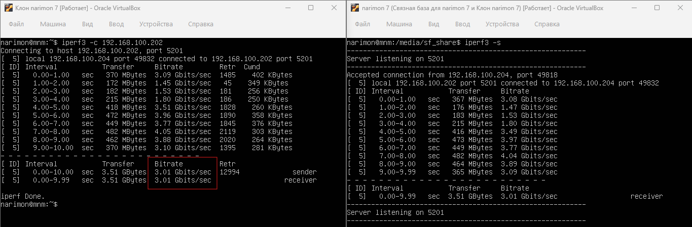](./08/prove/3.1.png)

[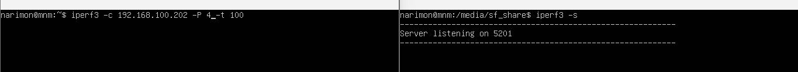](./08/prove/3.2.png)

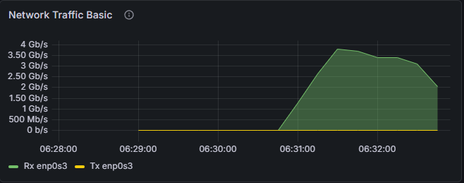

--- 

### 9. Custom Node Exporter (Bash Version)

#### 📖 Description

This script is a lightweight custom monitoring solution that collects basic system metrics and exposes them in a format compatible with **Prometheus**.

It works as a simple alternative to Node Exporter and is implemented using **Bash**.

The exporter:
- Collects system metrics (CPU, RAM, Disk)
- Updates data automatically every few seconds
- Serves metrics via **NGINX** in Prometheus format

---

#### ⚙️ Requirements

- Ubuntu / Debian-based system
- Bash
- NGINX installed and running
- `sudo` privileges

---

#### 🚀 Usage:

```bash
./main.sh <OPTION>
```

| Option     | Description                                       |
| ---------- | ------------------------------------------------- |
| `--start`  | Start the exporter (requires `sudo` privileges)   |
| `--stop`   | Stop the exporter (requires `sudo` privileges)    |
| `--status` | Check exporter status (requires `sudo` privileges)|
| `--help`   | Show help message (requires `sudo` privileges)    |
&nbsp;  

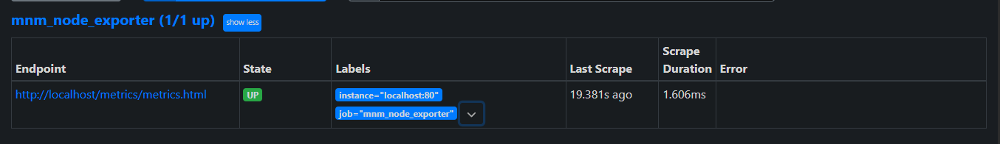 

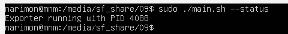 

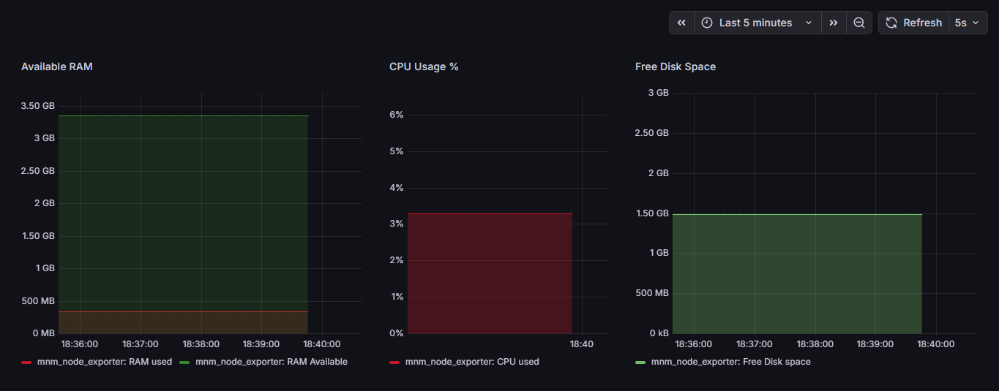

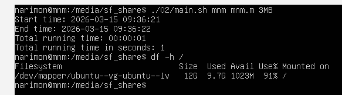 

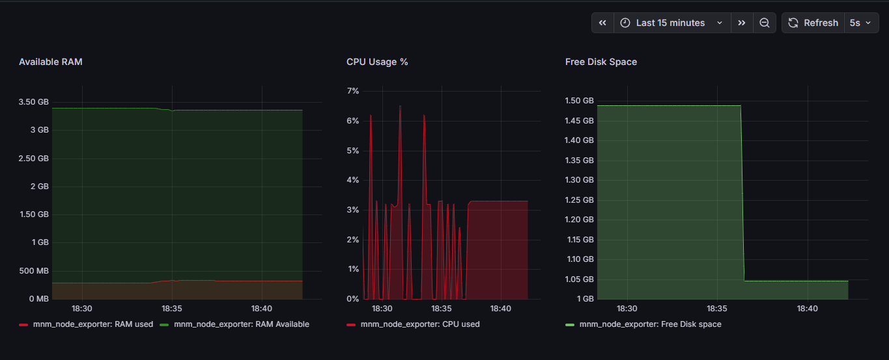

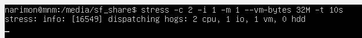 

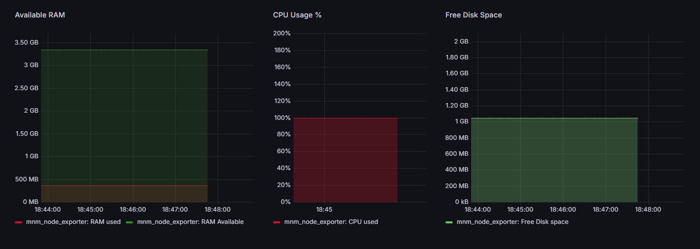

---

### 📊 Example Use Cases  
- Load testing a server
- Learning system monitoring
- Practicing DevOps tools
- Simulating real-world logs
- Building dashboards

### ⚠️ Notes  
- Scripts intentionally generate heavy load — use carefully
- Always test in a virtual machine
- Cleanup scripts are provided and recommended after testing

---

## ⭐ Support the Project

If this project helped you or you found it useful:

✨ Give it a **star** on GitHub  
🚀 Share it with others  
💡 Use it in your own projects  

Your support motivates further development!

---
