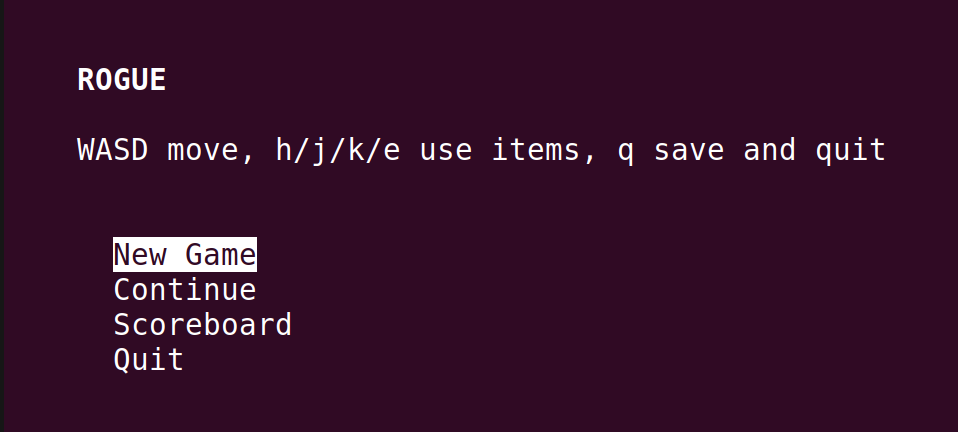
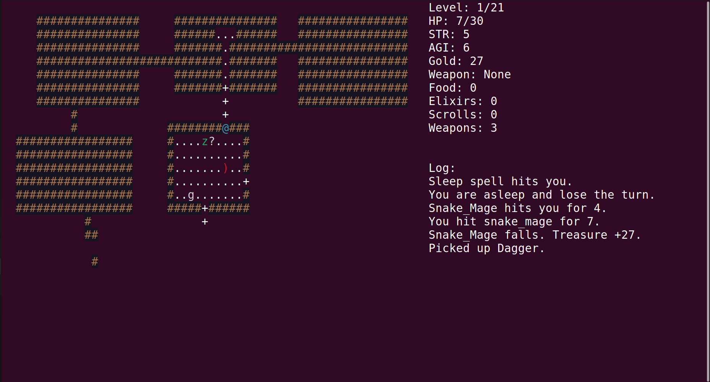
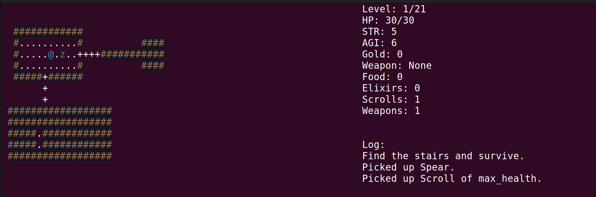
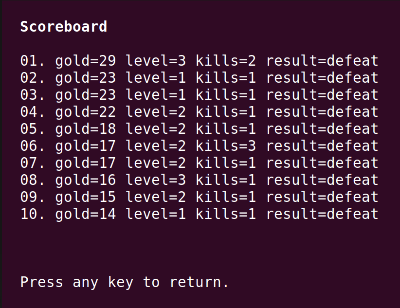

# 🕹️ Rogue-like Console Game  [Link](./game_in_terminal/)
### *Python | Curses | Procedural Generation | Team work with Kolya(who did most of the work)*

<p align="center">
  
  
</p>

<p align="center">
  
  
</p>

---

## 📌 Overview

A **console-based roguelike game** inspired by the classic *Rogue (1980)*.  
Built using **Python** and the **curses library**, this project demonstrates clean architecture, procedural generation, and turn-based gameplay mechanics.

---

## ✨ Features

- 🗺️ Procedurally generated dungeon (21 levels)
- ⚔️ Turn-based combat system
- 👾 Multiple enemy types with unique AI
- 🎒 Inventory & item system
- 💾 Save/Load system using JSON
- 📊 Persistent statistics & leaderboard
- 🌫️ Fog of war & visibility system

---

## 👥 Team Work

This project was developed as a **team collaboration**.

- 🤝 Worked closely with **Kolya**
- 💡 Shared design decisions and architecture planning
- 🔧 Kolya implemented many core components
- 🛠️ I improved, debugged, and refined the system
- 🚀 Together we completed the full project successfully

> This project reflects strong teamwork, communication, and real-world collaboration.

---

## 🧱 Project Structure

```
rogue/
├── domain/ # Game logic (entities, mechanics)
├── data/ # Saving/loading (JSON)
└── presentation/ # UI (curses rendering)

```


---

## 🎮 Gameplay

### 🗺️ Dungeon
- 21 levels
- Each level contains 9 rooms + corridors
- Increasing difficulty

### ⚔️ Combat
- Turn-based
- Hit chance depends on dexterity
- Damage depends on strength & weapon

### 👾 Enemies
- Zombie 🧟
- Vampire 🧛
- Ghost 👻
- Ogre 💪
- Snake Mage 🐍

Each enemy has **unique mechanics and behavior**

---

## 🎒 Inventory System

- Backpack with limited slots
- Items:
  - 🍖 Food → restores health
  - 🧪 Elixirs → temporary boosts
  - 📜 Scrolls → permanent upgrades
  - 🗡️ Weapons → increase damage

---

## 🎯 Controls

| Key | Action |
|-----|--------|
| W A S D | Move |
| H | Equip weapon |
| J | Use food |
| K | Use elixir |
| E | Use scroll |
| 1–9 | Select item |
| 0 | Unequip weapon |

---

## ▶️ How to Run

### 🔧 Requirements
- Python **3.10**
- Linux / macOS terminal (for curses)

---

### 🚀 запуск (Run) [Link folder for run](./game_in_terminal/)

```bash
git clone <your-repo-url>
cd your-project
cd game_in_terminal
python3 main.py
```
---

### 💾 Save System
- Auto-save after each level
- Resume previous session
- Leaderboard stored in JSON

---

### 📊 Statistics

Tracked across runs:
- 💰 Treasure collected
- 🏆 Max level reached
- ⚔️ Enemies defeated
- 🍖 Food used
- 🧪 Elixirs used
- 📜 Scrolls read
- 🎯 Hits & attacks
- 🚶 Tiles explored
---

### 🧠 What I Learned
- Clean Architecture principles
- Layer separation (Domain / UI / Data)
- Procedural generation logic
- Working with curses
- Team collaboration & debugging

---

### 📌 Final Thoughts

- This project was a strong step into real-world development:

- Writing structured and scalable code
- Collaborating effectively in a team
- Building a complete working game from scratch
---

### ⭐ Support
- If you like this project, consider giving it a ⭐ on GitHub!