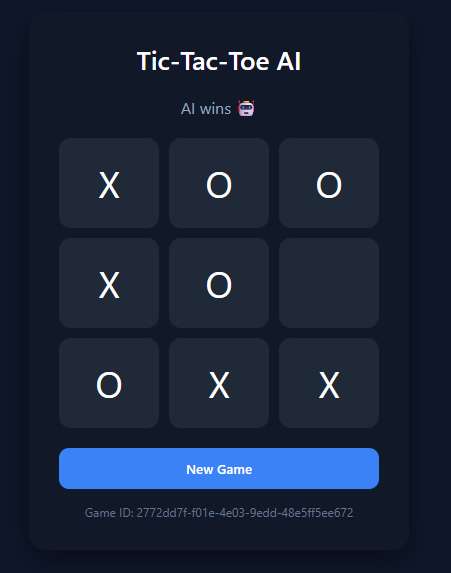
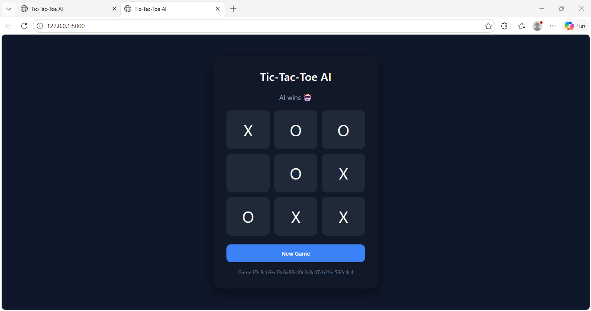

# 🎮 Tic-Tac-Toe AI (Flask Web Application) [link](./web_game/)

<p align="center">
  
</p>

## 📌 Project Overview

This project is a web-based **Tic-Tac-Toe game with AI**, developed as part of the *Python Bootcamp*.
It demonstrates how to build a structured web application using:

* Flask (backend)
* REST API
* Minimax algorithm (AI logic)
* Layered architecture (MVC-inspired)

The application allows a user to play against an AI opponent in real time through a browser.

---

## 🧠 Features

* ✅ Play Tic-Tac-Toe vs AI
* ✅ AI powered by Minimax algorithm
* ✅ Multiple games supported via UUID
* ✅ Game state validation
* ✅ Clean and responsive UI
* ✅ Separation of concerns (Web / Domain / Datasource / DI)

---

## 🏗️ Project Architecture

The project follows a **layered architecture**:

```
tic_tac_toe/
│
├── web/           # Handles HTTP requests (Flask)
│   ├── model/
│   ├── route/
│   ├── mapper/
│   └── module/
│
├── domain/        # Business logic
│   ├── model/
│   └── service/
│
├── datasource/    # Data storage layer
│   ├── model/
│   ├── repository/
│   ├── mapper/
│   └── service/
│
├── di/            # Dependency Injection
│
└── templates/     # HTML frontend
```

---

## ⚙️ Technologies Used

* Python 3
* Flask
* HTML / CSS / JavaScript
* UUID (for game sessions)

---

## 🤖 AI Logic

The AI uses the **Minimax algorithm**, which:

* Evaluates all possible moves
* Chooses the optimal move
* Guarantees:

  * Win if possible
  * Draw otherwise

---

## 🔌 API Endpoint

### POST `/game/{game_id}`

#### Request:

```json
{
  "board": [
    [0, 1, 0],
    [2, 0, 0],
    [0, 0, 0]
  ]
}
```

#### Response:

```json
{
  "board": [
    [0, 1, 0],
    [2, 2, 0],
    [0, 0, 0]
  ]
}
```

---

## 🖥️ User Interface

* Interactive 3x3 grid
* Real-time updates
* Status messages (win / lose / draw)
* AI thinking indicator

---

## 📸 Screenshot

<p align="center">
  
</p>

---

## 🚀 How to Run

1. Clone the repository:

```bash
git clone <your-repo-url>
cd <project-folder>
```

2. Install dependencies:

```bash
pip install flask
```

3. Run the application:

```bash
python main.py
```

4. Open in browser:

```
http://127.0.0.1:5000/
```

---

## 🧩 Key Concepts Learned

* Web application structure
* REST API design
* Flask routing
* Dependency Injection
* Clean architecture principles
* AI decision-making with Minimax

---

## ⚠️ Notes

* Each game is identified by a unique UUID
* The backend ensures game validation and prevents cheating
* Thread-safe storage is used for handling multiple games

---

## 📈 Future Improvements

* Add difficulty levels
* Add multiplayer mode
* Store game history
* Improve UI animations

---

## 👨‍💻 Author

Narimonjon Murodov

---

## ✅ Status

✔ Completed all required tasks
✔ Added frontend (bonus improvement)
✔ Fully functional AI gameplay

---
