## Part 1. Installation of the OS
- 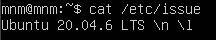

## Part 2. Creating a user
- `sudo adduser narimon`
- `usermod -G adm narimon`  
- 

## Part 3. Setting up the OS network
- Set the machine name as `user-1` :  
  `sudo hostnamectl set-hostname user-1`  
  cheking :  
  `hostname`  
    
  - I used `hostnamectl` to permanently change the system hostname to `user-1`

- Set the time zone corresponding to my current location :  
  list of time zones : `timedatectl list-timezones | grep Asia`  
  setting time zone : `sudo timedatectl set-timezone Asia/Tashkent`  
  cheking : `timedatectl`  
    

- lo is loopback => for computer to talk to itself => for testing softwers locally
 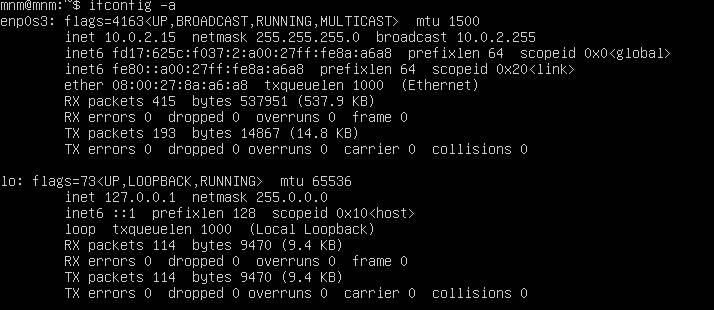
- 
- DHCP: Dynamic Host Configuration Protacol => it gives me avtomatically ipaddress, default gate away (router address), dns, etc when i join netork. Its like automatic network manager
- DHCP is like an automatic network manager — it saves you from entering all the network settings manually.
- external IP:  
  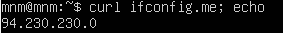 => 94.230.230.0
- internal IP:  
  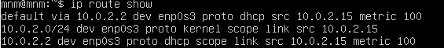 => 10.0.2.2
- Set static by netplan:    
  `sudo nano /etc/netplan/00-installer-config.yaml`   
  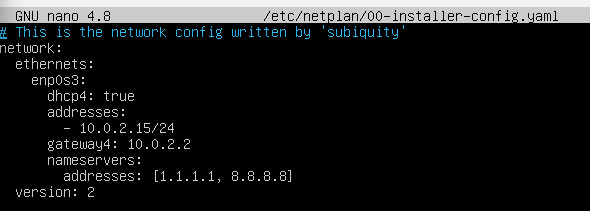  
  `sudo netplan apply`

- After reboot:  
  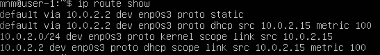 

- `ping 1.1.1.1 and ya.ru`:  
  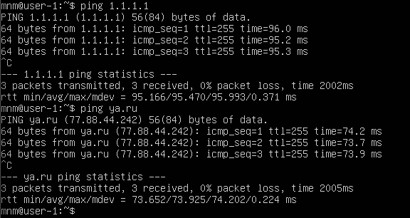  

## Part 4. OS Update
- `sudo apt update`
- `sudo apt upgate -y`
- `sudo apt update`:  
  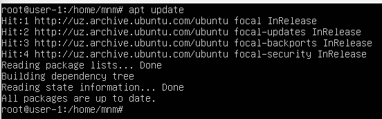

## Part 5. Using the sudo command
- `sudo` = "superuser do"  
  - It is an administrative command that allows a user to execute commands with **root (administrator) privileges**, giving access to all system permissions.
- 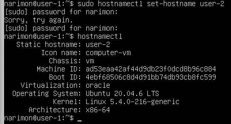

## Part 6. Installing and configuring the time service
- `sudo timedatectl set-ntp true`
- `timedatectl status`
- `timedatectl list-timezones | grep "Asia/Tashkent"`
- `sudo timedatectl set-timezone Asia/Tashkent`
- `timedatectl`:  
  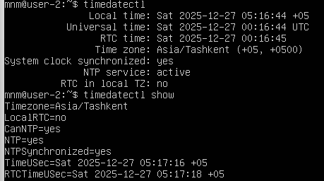
- `date`:  
  
## Part 7. Installing and using text editors
- **vim**:  
  - `vim test_vim.txt`:  
    `press` **i**  (for --insert mode)  
    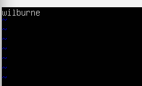
  - then `press` Esc => `:wq` => **w**rite (save) + **q**uite

- **nano**:  
  - `nano test_nano.txt`:  
    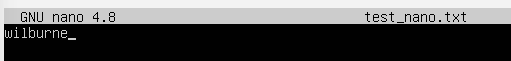
  - then `press` **Ctrl + O**  (write/save file) => `press` **Ctrl + X**  (exit/quit **nano**)

- **mcedit**:  
  - `mcedit test_mcedit.txt`:  
    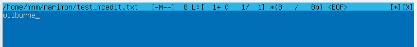
  - then `press` **F2**  (Save) => `press` **F10**  (Quit)
  ## Without Save  
- **vim**:  
  - `vim test_vim.txt`:  
    `press` **i**  (for --insert mode)      
    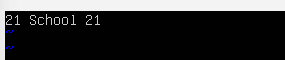
  - then `press` Esc => `:wq`

- **nano**:  
  - `nano test_nano.txt`:  
    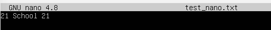
  - then `press` **Ctrl + X**  => save: `press` **N** (No) => `press` **Enter**

- **mcedit**:  
  - `mcedit test_mcedit.txt`:  
    
  - then  `press` **F10**  (Quit) => `press` **[ No ]**  

  ## Search and Raplace  
- **vim**:  
  - `vim test_vim.txt`:   
    **Search**:      
    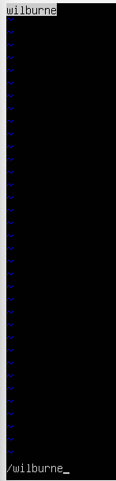  
    **Search/Raplace**:    
    

- **nano**:  
  - `nano test_nano.txt`:  
    **Search**: `Press Ctrl` + `W` (Where) → type the word → `Enter`  
    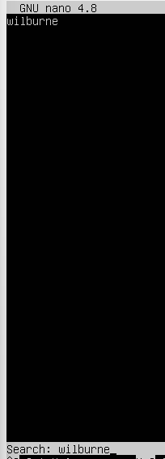  
    **Search/Raplace**:  
    Press ` Ctrl + \ ` (Backslash) → type the word to replace → Enter → type the new word → Enter  
    

- **mcedit**:   
  - `mcedit test_mcedit.txt`:  
  **Search**:   `Press` **F7**  
      
  **Search/Raplace**:  `Press` **F4**  
      
  

## Part 8. Installing and basic setup of the SSHD service
- Install SSHd service :  
  `sudo apt update`  
  `sudo apt install openssh-sever -y`

- Enable SSHd to start automatically on boot :  
  `sudo systemctl enable ssh`

- Reset the SSHd service to `port` `2022` :  
  `sudo nano /etc/ssh/sshd_config`  
    
  `sudo systemctl restart ssh`

- Verify that sshd process is running :  
  `ps -aux | grep sshd` :    
    - `ps` → shows running processes.  
    - `-a` → shows processes from all users.
    - `-u` → shows the user who owns each process. ( optional )
    - `-x` → shows processes that don’t have a terminal (like daemons).
    - `| grep sshd` → filters output to only show lines containing “sshd”.   
       
  `ps -ax | grep sshd` :      
      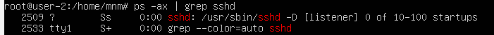
- `sudo reboot`
  
- `sudo netstat -tan` :  
  - `-t` → show TCP connections.
  - `-a` → show all sockets (listening + non-listening).
  - `-n` → show IPs and ports as numbers (not names).
  
  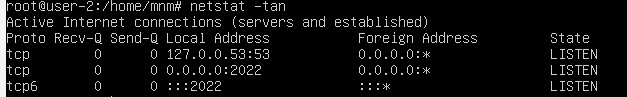  
    - **Proto** => Protocol =>  Shows the type of connection (here it’s `tcp`).  
    - **Recv-Q** => Receive Queue => Data waiting to be received (0 means nothing waiting).      
    - **Send-Q** => Send Queue => Data waiting to be sent (0 means nothing waiting).         
    - **Local Address** => My computer’s IP and port => Shows where my computer is listening — here, `0.0.0.0:2022`. 
    - **Foreign Address** => Remote computer => Shows who’s connecting (here `*` means “anyone”).              
    - **State** => Connection status => `LISTEN` means SSH is ready to accept connections.             
    
  `0.0.0.0` means all network interfaces on my computer :  
    - **SSH** is listening on any IP address your computer has — not just one specific one

  
## Part 9. Installing and using the top, htop utilities
- Instalation:  
  `sudo apt update`  
  `sudo apt install procps htop -y`
  
- `top` :  
    
    - uptime :  `32 min`
    - number of authorised users : `1`
    - average system load : `0.00, 0.00, 0.00`
    - total number of processes : `99`
    - cpu load : `0.0 us, 0.3 sy, 0.0 ni, 99.7 id, 0.0 wa, 0.0 hi, 0.0 si, 0.0 st`
    - memory load : `1971.6 total,   1096.0 free,   153.0 used,   722.0 buff/cache`
    - pid of the process with the highest memory usage : `1`
    - pid of the process taking the most CPU time : `1683`
    
- `htop` :  
  - sorted by PID, PERCENT_CPU, PERCENT_MEM, TIME `F6` :  
    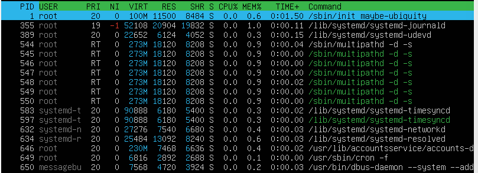  
    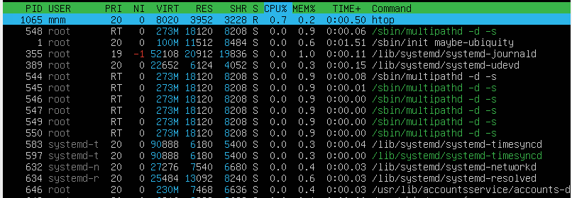  
      
      
  - filtered for sshd process `F4` :  
    
  - with the syslog process found by searching `F3` :  
    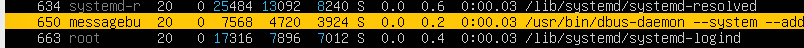
  - with hostname, clock and uptime output added `F2` => change => `F10` (save) :  
    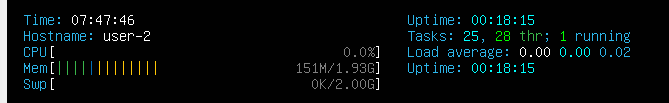  
  
## Part 10. Using the fdisk utility
- `fdisk -l` :  
  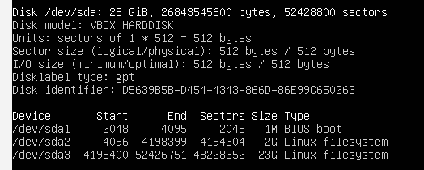  
  - Disk name : `/dev/sda` 
  - Capacity : `25 GiB`  
  - Number of sectors : `52428800`  
  - Swap partition size :  
    The system uses a swap file located at `/swap.img` instead of a separate partition.  
      
    -  Swap size :  `2G`  
      Swap is used as extra RAM when the physical memory is full

## Part 11. Using the df utility

- `df` command:  
  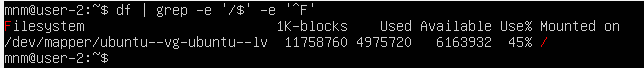 :  
  - partition size : `11758760 Kbytes`  
  - space used : `4975720 Kbytes`  
  - space free : `6163932 Kbytes`  
  - percentage used :  `45 %`  
  
- `df -Th` command:  
   :  
  - partition size : `12 Gbytes`  
    -  file system type : `ext4`
  - space used : `4.8 Gbytes`  
  - space free : `5.9 Gbytes`  
  - percentage used :  `45 %`

## Part 12. Using the du utility
- 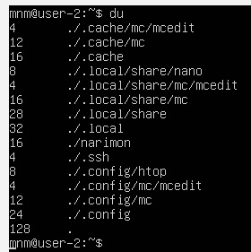  
-   
-   

## Part 13. Installing and using the ncdu utility
- `ncdu /home` :  
  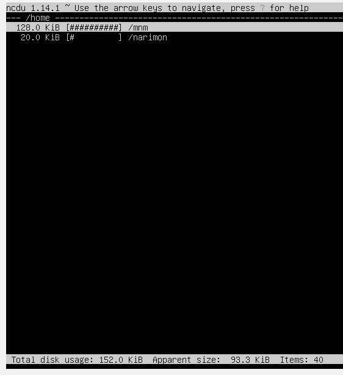  
  press `q` to quite
- `ncdu /var` :  
  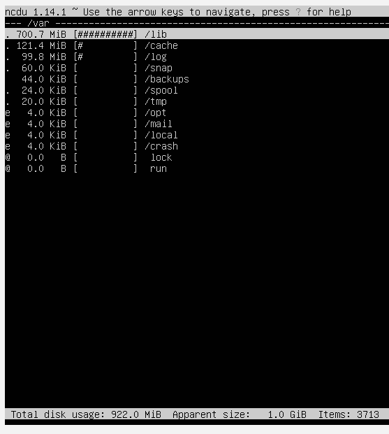  
  press `q` to quite
- `ncdu /var/log` :  
    
  press `q` to quite
  
## Part 14. Working with system logs
-  viewing :  
  `less /var/log/dmesg` :  
  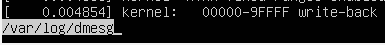  
  `less /var/log/syslog` :  
    
  `less  /var/log/auth.log` :  
  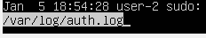
- `last -1` :  
    
  - user : `mnm`
  - login method : `tty1` => local console login
  - time : `Tuesday January 6  10:44`
- restarting shhd :  
  `sudo systemctl restart sshd`  
  `tail /var/log/syslog`  
  

## Part 15. Using the CRON job scheduler
- `crontab -e` => press `1` for `nano editor` => press `Enter` :  
    
  Press `Ctrl + O` for save => Press `Enter` => Press `Ctrl + X` for exit

- `tail /var/log/syslog` :  
    

- `crontab -l` :  
  

- `crontab -r` => `crontab -l` :  
  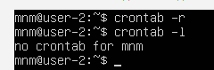
  
  
  